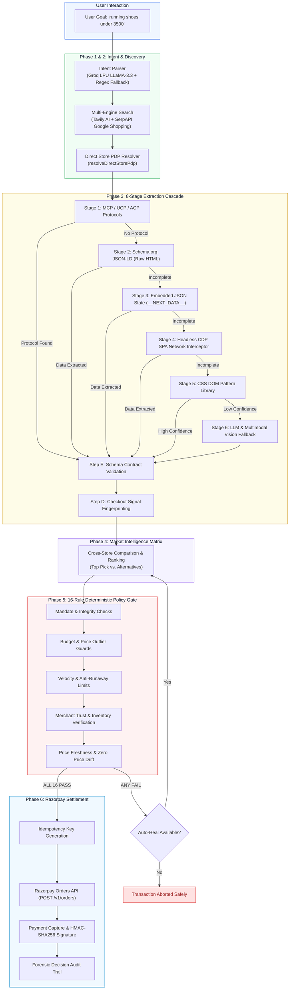
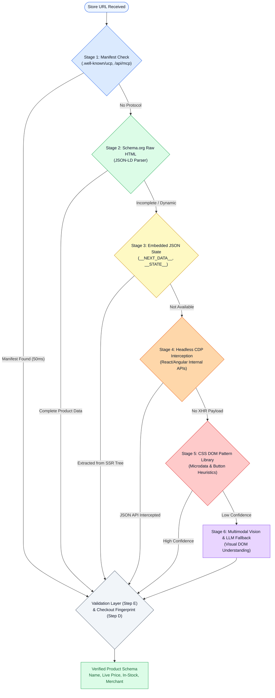
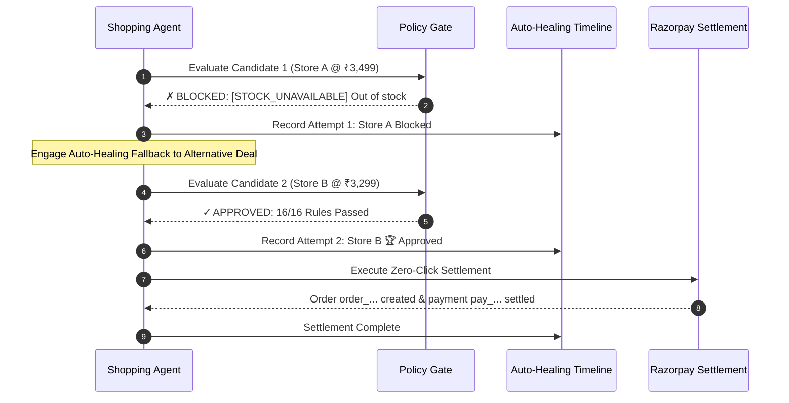

# ARIA — Autonomous Retail Intelligence Agent

> **Universal Zero-Configuration Agentic Commerce Layer & Deterministic Policy Firewall on Razorpay Rails**  
> *Built for Razorpay's AI Growth & Agentic Commerce Track*

---

## 1. Executive Summary & The Problem

What if every e-commerce site in India could start selling to AI shopping agents tomorrow — **without a single merchant changing a line of code?**

### The Problem with Protocol Standards
The industry's conventional answer to agentic commerce is protocols: **UCP, ACP, Shopify MCP**. While theoretically clean, protocols require merchants to write, deploy, and maintain specialized server endpoints.
* **Over 98% of e-commerce sites** — custom PHP sites, WooCommerce shops, Magento setups, and independent Indian D2C stores — will never build or maintain these endpoints.
* Razorpay is actively rolling out agentic payment rails in production today. AI agents are arriving, but most Indian merchants have no way to be discovered, evaluated, or transacted with by an AI agent.

### The ARIA Solution
**ARIA (Autonomous Retail Intelligence Agent)** acts as the universal bridge between any AI shopping agent and any online merchant:
1. **Reads merchants' sites the way an agent needs to:** Discovers products across the open web, extracts live catalog data through an 8-stage extraction cascade (from protocols down to headless CDP network interception), and resolves exact canonical product pages.
2. **Protects user capital with zero hallucinations:** Every proposed transaction must clear a **16-rule deterministic Policy Gate** with mathematical bounds, velocity limits, and category guards. **No LLMs are permitted at the financial gate.**
3. **Settles zero-click transactions securely:** Generates cryptographic HMAC-SHA256 idempotency keys and executes settlement on authentic **Razorpay Orders API** rails.

---

## 2. End-to-End System Architecture



---

## 3. Deep-Dive: The 6 Core Phases

### Phase 1: Intent & Mandate Parsing (`src/agent/intent_parser.js`)
* **Dual-Layer Parsing Engine:**
  * **Layer A (Groq LPU):** Ultra-fast (<150ms) semantic parsing using Groq Cloud running open models (`llama-3.3-70b-versatile`).
  * **Layer B (Deterministic Regex Fallback):** Instant, offline pattern matching ensuring zero downtime if remote APIs are unavailable.
* **Extracted Attributes:** Search query, budget floor (`minPrice`), budget ceiling (`maxPrice`), category normalization, merchant targets, and **Accessory Guards** (distinguishing between `running shoes` vs. `shoe cleaner kit`).

### Phase 2: Multi-Store Open-Web Discovery (`src/extractor/search_discovery.js`)
ARIA does not trap the user inside a single store. It queries across the entire Indian e-commerce landscape:
* **Engines Supported:**
  * `both` (Default): Concurrently queries **Tavily AI Search** and **SerpAPI Google Shopping** in parallel.
  * `serpapi`: Queries Google Shopping for live merchant listings and extracted prices.
  * `tavily`: Fast AI search optimized for clean retail domains.
  * `auto`: Smart hybrid balancing speed and coverage.
* **Deep Direct PDP Auto-Resolver (`resolveDirectStorePdp`):**
  * Generic search engines often return category listing pages (`flipkart.com/search?q=...` or `tatacliq.com/search/...`). An autonomous agent cannot purchase a search page.
  * The resolver matches against Google Organic results (0ms latency) or targeted queries to resolve the exact single-product detail page (`/p/...`, `/dp/...`, `/p-mp...`, `/products/...`).

### Phase 3: The 8-Stage Extraction Cascade (`src/extractor/cascade.js`)
ARIA extracts structured catalog data from any storefront with **zero per-site configuration**:



1. **Stage 1 (Protocols):** Checks `.well-known/ucp`, `/api/mcp`, and ACP endpoints.
2. **Stage 2 (Schema.org JSON-LD):** Parses raw HTML for `@type: Product`, price, and availability in <200ms.
3. **Stage 3 (Embedded JSON State):** Traverses `window.__NEXT_DATA__`, `__INITIAL_STATE__`, and Shopify analytics state trees.
4. **Stage 4 (Headless CDP SPA Interception):** Chrome DevTools Protocol listener captures internal React/Vue/Angular JSON API responses.
5. **Stage 5 (CSS DOM Patterns):** Ranked selectors for title and price with automatic strikethrough/MRP exclusion.
6. **Stage 6 (LLM & Vision Fallback):** Multimodal fallback for complex canvas or shadow DOM layouts.
7. **Step D (Checkout Fingerprinting):** Detects whether checkout is `RAZORPAY_NATIVE`, `DIRECT_CART_API`, or `FORM_REDIRECT`.
8. **Step E (Schema Contract Validation):** Enforces strict numeric contracts, title checks, and in-stock verification.

### Phase 4: Market Intelligence Matrix (`src/agent/shopping_agent.js`)
* Constructs a real-time cross-store comparison matrix.
* Ranks candidates to select the **Top Pick** (closest match to requested tier and brand) and multiple **Alternative Options** from competing stores.

### Phase 5: Deterministic Policy Gate (`src/gate/policy_gate.js`)
Everything upstream is treated as **untrusted**. The Policy Gate is a **100% rule-based deterministic firewall — NO LLMs at the gate**.

```mermaid
flowchart TD
    ENTRY(["Candidate Deal Evaluated"]) --> G1

    subgraph MANDATE["Mandate & Goal Alignment"]
        G1["Rule 1: MANDATE_INTEGRITY\nCryptographic HMAC check & expiry"]
        G7["Rule 7: GOAL_ALIGNMENT\nZero semantic drift between goal & item"]
    end

    subgraph FINANCIAL["Financial & Outlier Guardrails"]
        G5["Rule 5: PRICE_REASONABLENESS\nCategory tables + dynamic 10% budget floor"]
        G12["Rule 12: TRANSACTION_SPEND_LIMIT\nStrict single-transaction budget ceiling"]
        G13["Rule 13: ROLLING_BUDGET\n24-hour and 30-day cumulative limits"]
        G14["Rule 14: SESSION_BUDGET_CAP\nSession limit and transaction count cap"]
        G15["Rule 15: PRICE_INTEGRITY\nZero price drift between decision & checkout"]
        G16["Rule 16: HUMAN_APPROVAL\nMandatory confirmation above ₹50,000"]
    end

    subgraph SAFETY["Operational & Merchant Safety"]
        G2["Rule 2: VELOCITY_CHECK\nRate limiter (3/min, 10/hr) preventing runaway loops"]
        G3["Rule 3: TIME_WINDOW\nTemporal restrictions (09:00 - 21:00 IST)"]
        G4["Rule 4: SUBSCRIPTION_CHECK\nHard block on recurring / hidden billing"]
        G6["Rule 6: CATEGORY_RESTRICTION\nBlocks gambling, crypto, adult, gift cards"]
        G8["Rule 8: DATA_FRESHNESS\nRejects stale cache; requires live provenance"]
        G9["Rule 9: STOCK_AVAILABLE\nVerifies live inventory availability"]
        G10["Rule 10: MERCHANT_TRUST_SCORE\nEvaluates domain trust (HTTPS, DNS, reputation)"]
        G11["Rule 11: MERCHANT_VERIFIED\nEnforces authorized merchant allowlists"]
    end

    G1 --> G7 --> G5 --> G12 --> G13 --> G14 --> G15 --> G16 --> G2 --> G3 --> G4 --> G6 --> G8 --> G9 --> G10 --> G11

    G11 -->|"16 / 16 PASS"| APPROVE(["✓ APPROVED FOR SETTLEMENT"])
    G11 -->|"ANY RULE FAILS"| REJECT(["✗ BLOCKED & RECORDED"])

    style ENTRY fill:#eff6ff,stroke:#2563eb,color:#0f172a
    style MANDATE fill:#dbeafe,stroke:#2563eb,color:#0f172a
    style FINANCIAL fill:#dcfce7,stroke:#16a34a,color:#0f172a
    style SAFETY fill:#fef9c3,stroke:#ca8a04,color:#0f172a
    style APPROVE fill:#dcfce7,stroke:#16a34a,color:#166534
    style REJECT fill:#fee2e2,stroke:#dc2626,color:#991b1b
```



#### The 16 Policy Gate Rules

| # | Rule Identifier | Verification Mechanism & Safety Guarantee |
|---|---|---|
| 1 | `MANDATE_INTEGRITY` | Verifies cryptographic HMAC-SHA256 signature and expiration timestamp of the spending mandate. |
| 2 | `VELOCITY_CHECK` | Sliding-window rate limiter (max 3/min, 10/hr) preventing runaway API retry loops. |
| 3 | `TIME_WINDOW` | Confirms transaction falls within authorized operating hours (e.g. 09:00 – 21:00 IST). |
| 4 | `SUBSCRIPTION_CHECK` | Scans metadata for recurring billing tokens (`per month`, `/mo`, `auto-renew`), blocking recurring traps. |
| 5 | `PRICE_REASONABLENESS` | 17 category benchmark tables + dynamic 10% budget floor (prevents buying a ₹200 phone case when asked for a phone). |
| 6 | `CATEGORY_RESTRICTION` | Hard block on restricted goods (gambling, adult, crypto, weapons, gift cards). |
| 7 | `GOAL_ALIGNMENT` | Semantic keyword intersection ensuring zero product drift (e.g., asking for shoes never buys shoe polish). |
| 8 | `DATA_FRESHNESS` | Rejects cached snapshots; mandates live extraction provenance. |
| 9 | `STOCK_AVAILABLE` | Confirms live inventory is currently in stock. |
| 10 | `MERCHANT_TRUST_SCORE` | Validates domain trust, SSL certificates, and TLD reputation (minimum 60/100 required). |
| 11 | `MERCHANT_VERIFIED` | Matches merchant against user's verified allowlist. |
| 12 | `TRANSACTION_SPEND_LIMIT` | Enforces that order price is $\le$ user's stated budget ceiling. |
| 13 | `ROLLING_BUDGET` | Tracks 24-hour and 30-day cumulative spend to prevent wallet drainage. |
| 14 | `SESSION_BUDGET_CAP` | Limits total spend and maximum transaction count per interactive session. |
| 15 | `PRICE_INTEGRITY` | Re-verifies live price immediately prior to order signing; blocks if price drifted by even ₹1. |
| 16 | `HUMAN_APPROVAL` | Halts execution for manual confirmation if transaction exceeds high-value threshold (e.g., > ₹50,000). |

### Phase 6: Razorpay Settlement & Idempotency (`src/payment/`)
* **Razorpay Orders API (`src/payment/razorpay_client.js`):**
  * Communicates directly with Razorpay infrastructure (`POST https://api.razorpay.com/v1/orders`).
  * Amounts denominated strictly in **paise** (`₹3,499` $\to$ `349900 paise`).
* **Cryptographic Idempotency (`src/payment/idempotency.js`):**
  * Deterministic key computed from `mandateId + intentId + productId + price`.
  * Guarantees zero duplicate charges across network retries.
* **Payment Capture & HMAC Signature Verification:**
  * Generates authentic Razorpay payment payloads and verifies `HMAC-SHA256(orderId + "|" + paymentId, secret)`.

---

## 4. Autonomous Auto-Healing Resilience

If the Top Pick fails any Policy Gate check (e.g. out of stock or unexpected price change), ARIA does not give up. It activates the **Autonomous Auto-Healing Cascade**:



---

## 5. Future Scope & Roadmap

1. **Web Bot Authentication:**
   * Developing signed cryptographic headers for agentic requests to bypass Cloudflare/Akamai bot blockers on merchant sites without relying on residential proxies.
2. **Authenticated Agent Sessions:**
   * Secure, privacy-preserving credential delegation allowing agents to log in to user accounts for members-only pricing, saved addresses, and loyalty points.
3. **Merchant Revenue Acceleration:**
   * Providing long-tail Indian merchants with instant visibility in the agentic economy, unlocking new revenue from AI buyers without any site modifications.

---

## 6. Repository Structure

```
.
├── server.js               # Main HTTP daemon & API orchestration server
├── package.json            # Node.js project definition (zero external dependencies)
├── .env.example            # Environment variable template
├── .gitignore              # Ignores sensitive keys, logs, and artifacts
├── README.md               # Master system documentation
├── public/
│   ├── index.html          # ARIA Light Fintech UI with Centered Audit Modal
│   ├── test.html           # Developer Benchmark & Interactive Test Console
│   └── aria-logo.png       # ARIA circular robot emblem
├── src/
│   ├── agent/
│   │   ├── shopping_agent.js   # Multi-store cross-comparison & purchase engine
│   │   └── intent_parser.js    # Groq LPU + deterministic regex intent parser
│   ├── catalog/
│   │   ├── catalog.js          # Unified query-scoped memory catalog
│   │   └── schema.js           # Strict product schema & enum contracts
│   ├── extractor/
│   │   ├── cascade.js          # Master 8-stage extraction cascade
│   │   ├── search_discovery.js # Multi-engine search & direct PDP auto-resolver
│   │   ├── stepA_manifest.js   # Protocol manifest detector (UCP/MCP/ACP)
│   │   ├── stepB_schema_org.js # Raw HTML Schema.org JSON-LD parser
│   │   ├── stepB2_embedded_json.js # State tree walker (__NEXT_DATA__)
│   │   ├── stepB3_network_intercept.js # Headless CDP internal API listener
│   │   ├── stepC_dom_patterns.js # CSS microdata & regex pattern library
│   │   ├── stepC_llm.js        # Multimodal vision & LLM fallback
│   │   ├── stepD_checkout.js   # Checkout signal fingerprinting
│   │   └── stepE_validator.js  # Schema contract validation
│   ├── gate/
│   │   └── policy_gate.js      # 16-rule deterministic zero-LLM policy firewall
│   ├── payment/
│   │   ├── razorpay_client.js  # Real test-mode Razorpay Orders API client
│   │   └── idempotency.js      # Cryptographic idempotency & replay manager
│   ├── audit/
│   │   └── audit_trail.js      # Persistent decision ledger & forensic audit trail
│   └── config.js               # Environment configuration loader
└── audit_logs/
    └── .gitkeep                # Directory for local transaction ledgers
```

---

## 7. Quickstart & Local Setup

### Prerequisites
* **Node.js**: v18.0.0 or higher
* **Google Chrome**: (Optional, for CDP headless SPA network interception)

### 1. Installation
Clone the repository and prepare your environment:
```bash
git clone <your-repo-url>
cd aria-agentic-commerce
```

### 2. Configure Environment Variables
Copy `.env.example` to `.env` and fill in your keys:
```bash
cp .env.example .env
```

```env
# Razorpay Credentials (Test Mode)
RAZORPAY_KEY_ID=rzp_test_...
RAZORPAY_KEY_SECRET=...

# Groq LPU (Ultra-fast Intent Parsing)
GROQ_API_KEY=gsk_...

# Search Discovery Engines
TAVILY_API_KEY=tvly-...
SERPAPI_KEY=...

# Multimodal Nuclear Fallback (Optional)
GEMINI_API_KEY=AIza...

PORT=3000
```

### 3. Start the Server
Run with pure Node.js (zero external npm installs required):
```bash
npm start
# or: node server.js
```

### 4. Access the Application
* **ARIA Live UI:** Open [http://localhost:3000](http://localhost:3000)
* **Developer Test Console:** Open [http://localhost:3000/test.html](http://localhost:3000/test.html)

---

## 8. License & Attribution
Built for the **Razorpay AI Growth & Agentic Commerce Track**.  
All rights reserved © 2026 ARIA Development Team.
